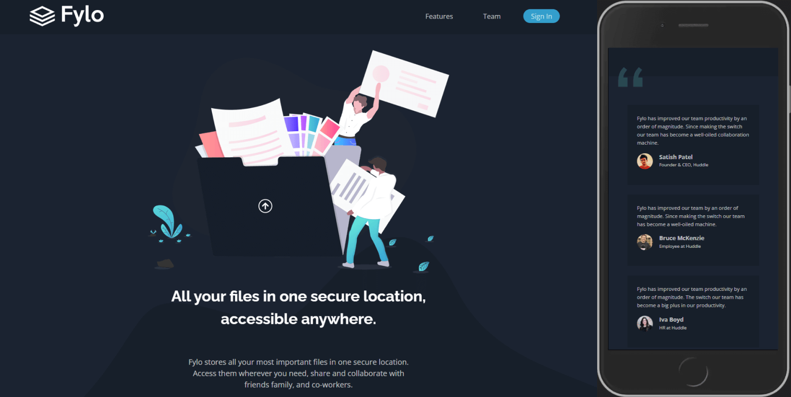

# Frontend Mentor - Fylo dark theme landing page solution

This is a solution to the [Fylo dark theme landing page challenge on Frontend Mentor](https://www.frontendmentor.io/challenges/fylo-dark-theme-landing-page-5ca5f2d21e82137ec91a50fd). Frontend Mentor challenges help you improve your coding skills by building realistic projects. 

## Table of contents

- [Overview](#overview)
  - [The challenge](#the-challenge)
  - [Screenshot](#screenshot)
  - [Links](#links)
- [My process](#my-process)
  - [Built with](#built-with)
  - [What I learned](#what-i-learned)
  - [Continued development](#continued-development)
  - [Useful resources](#useful-resources)
- [Author](#author)

## Overview

### The challenge

Users should be able to:

- View the optimal layout for the site depending on their device's screen size
- See hover states for all interactive elements on the page

### Screenshot

### Links

- Solution URL: [CODE](https://github.com/SinisaVukmirovic/FrontEnd-Mentor-challenge-7)
- Live Site URL: [DEMO](https://front-end-mentor-challenge-7-sandy.vercel.app/)

## My process

### Built with

- ASTRO SSG
- Astro View Transitions

### What I learned

- Practicing Astro in this project.
- Learning about the NEW View Transitions API in Astro
- Learned that View Transition API works by taking a "screenshot" of the current page (!!! how it looks like when page first loads !!!), so any "hidden" elements, like hidden elements that appear only after the scroll, through Intersection Observer removing hidden class for example, will remain hidden after going back to that page.

### Continued development

- Continue learning Astro

### Useful resources

- [Astro Docs](https://docs.astro.build/en/getting-started/) - Official Astro documentation

## Author

- Website - [Sinisa Vukmirovic](https://github.com/SinisaVukmirovic)
- Frontend Mentor - [@SinisaVukmirovic](https://www.frontendmentor.io/profile/SinisaVukmirovic)
- Twitter - [@sajtowski](https://twitter.com/sajtowski)
